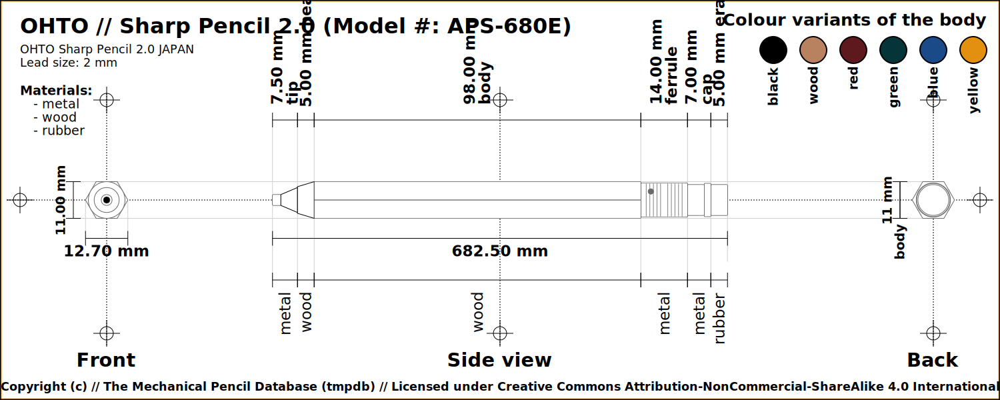

# The Mechanical Pencil Database - Data

The primary idea of this repository is to record the technical details of 
mechanical pencils (including clutch pencils and leadholders) for posterity. 

The data of the pencil in itself should be enough, however included in this 
repository are renderers that will parse this data and output various formats.

The base output format is SVG which can then be used to generate - which may 
then be included in other formats. 

For example:

 - The svg file is used to generate the png files.
 - The png files are then included in the pdf files.

The renderings and output files and formats are included in this repository, 
although they will probably disappear as the list of pencils becomes too large 
and unwieldly.

Contains data for mechanical pencils in JSON format which can then be utilised 
to generate all sorts of images and output data.

Despite the rendered outputs, the primary goal os to capture the data that the 
pencil comprises. 

**NOTE:** Since the base output is SVG the JSON data also contains content which 
is applicable to the SVG rendering output (and some others), which is 
then mixing up the technical pencil data with display data - this is 
unfortunate but a design decision.

## Directory structure

- `/docs/` - for documentations
- `/data/` - for mechanical pencil data
- `/output/` - For generated files, the subdirectories are named for the output 
  folder and will have subdirectories beneath it that are more descriptive of 
  what the output contains: **NOTE:** '`This directory is designed to be 
  transient`' and can be deleted without side effects, this can be 
  re-generated by the renderer at any time. 
  - `/output/png/` - Generated PNG files 
  - `/output/svg/` - Generated vector (SVG) files 
  - `/output/pdf/` - Generated vector (SVG) files 

## Examples

### OHTO Sharp Pencil 2.0

For the file `/data/ohto/sharp-pencil-2.0.json`, one of the SVG files that is generated.

and colour variants too (as PNGs)

### Mitsubishi Uni 

For the file `/data/mitsubishi/uni.json`, one of the SVG files that is 
generated.

and colour variants too (as PNGs)

## Updating CustomVector Images

All (or at least most) vector based images were made with 
[Provector](https://provector.app) which is an online and free Vector 
editing webapp.

The Saved File is a `.json` file which is stored in the 
`docs/provector/vectors/` directory.  The export of the images are saved in 
the `docs/provector/images` directory.

