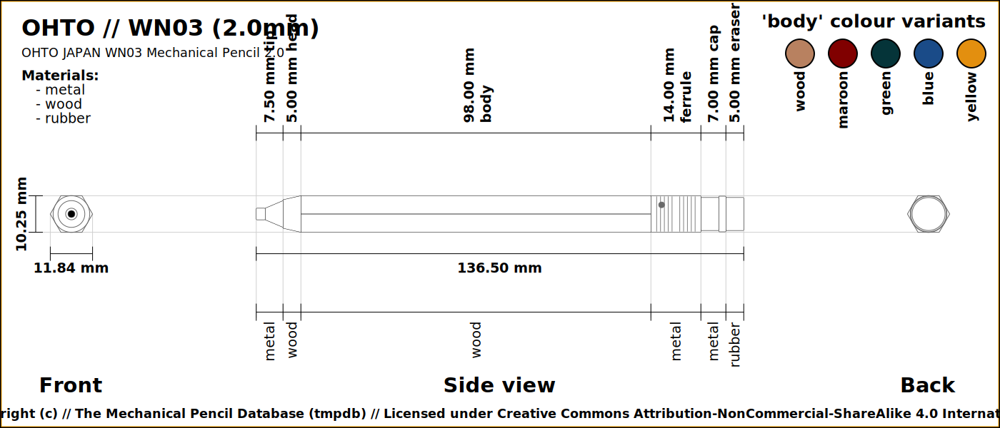

# The Mechanical Pencil Database - Data

Contains data for mechanical pencils in JSON format which can then be 
utilised to generate all sorts of images and output data.

## Directory structure

- `/docs/` - for documentations
- `/data/` - for mechanical pencil data
- `/output/` - For generated files
  - `/output/images/` - Generated PNG files 
  - `/output/vectors/` - Generated vector (SVG) files 

## Examples

### OHTO WN03

For the file `/data/ohto/sharp-pencil-wn03.json`, one of the SVG files that 
is generated.

and colour variants too (as PNGs)

### Mitsubishi Uni 

For the file `/data/mitsubishi/uni.json`, one of the SVG files that is 
generated.

and colour variants too (as PNGs)

## Updating CustomVector Images

All (or at least most) vector based images were made with 
[Provector](https://provector.app) which is an online and free Vector 
editing webapp.

The Saved File is a `.json` file which is stored in the 
`docs/provector/vectors/` directory.  The export of the images are saved in 
the `docs/provector/images` directory.

