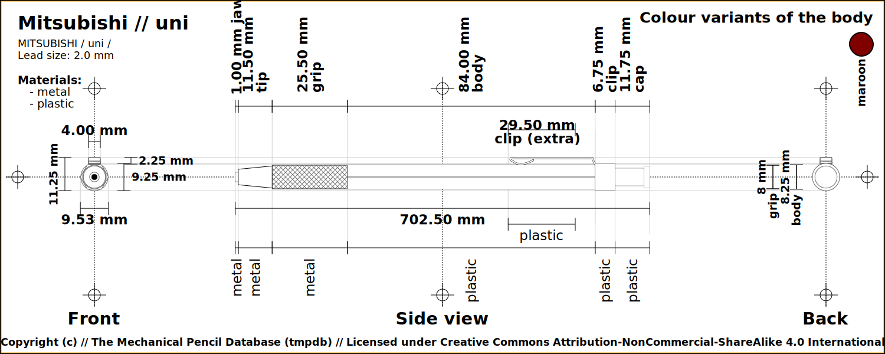

# The Mechanical Pencil Database - Data

The primary idea of this repository is to record the technical details of 
mechanical pencils (including clutch pencils and leadholders) for posterity. 

The data of the pencil in itself should be enough, however included in this 
repository are renderers that will parse this data and output various formats.

The base output format is SVG which can then be used to generate other 
formats, for example 

 - The svg file is used to generate a png file.
 - The png file is then included in a pdf file.

The renderings and output files and formats are included in this repository, 
although they will probably disappear as the list of pencils becomes too large 
and unwieldly.

Despite the rendered outputs, the primary goal os to capture the data that the 
pencil comprises. 

**NOTE:** Since the base output is SVG the JSON data also contains content which 
is applicable to the SVG rendering output (and some others), which is 
then mixing up the technical pencil data with display data - this is 
unfortunate but a design decision.

## Pencil definitions that are included in this repository

_(To regenerate the list - and this `README.md` file, run `npm run readme-generator` from the root of the project.)_

| Brand | Name | Model # | # Variants _(colours / patterns)_ | Accuracy |
| ---: | :--- | :--- | ---: | :--- |
| **Alvin** | **DA** | TECH | 3 | high |
| **Alvin** | **PRO-MATIC** | MC5 | 1 | high |
| **BIC** | **Criterium** | undefined | 3 | high |
| **Koh-i-Noor** | **TECHNIGRAPH** | 5611 | 7 | low |
| **Küelox** | **3308** | 3308 | 1 | high |
| **M &amp; G** | **Easy Come Easy Go!** | amp-35601 | 3 | high |
| **Mitsubishi** | **uni** | MH-500 | 1 | high |
| **Mr. Pen** | **2.0** | 2.0 | 1 | high |
| **OHTO** | **Sharp Pencil 2.0** | APS-680E | 6 | high |
| **Pacific Arc** | **COLLEGIATE** | H-1301 | 2 | high |
| **Pacific Arc** | **Premium** | H-1309 | 2 | high |
| **Pacific Arc** | **TECH PRO** | H-1305 | 5 | high |
| **Redcircle** | **600** | 600 | 3 | high |
| **Staedtler** | **Mars Technico** | 780c | 2 | high |
| **STUDMARK** | **3750** | 3750 | 1 | high |
| **Unbranded** | **Metal Black** | unknown | 1 | high |
| | | **16 Pencils** | **42 Variants** _(colours / patterns)_  |

### Accuracy Designations

#### low

 - Physical pencil not present
 - Measurements of the pencil were not taken with a precision tool, and may have been estimated from supplied images.
 - The overall look of the pencil and the relative dimensions should be within reasonable and relative bounds.
 - The pencil may be based on a third party branded model that is identical to the original.
 - It is unlikely that internal measurements have any level of relative accuracy, and, where supplied have been estimated.
 - There may be a low level of accuracy of the colours of the pencil's parts.

#### medium

 - Physical pencil present, however no precision measurement tool was used, or physical pencil not present and image used.  Where an image is used for measurements, an accurate measuring scale is included with the image.
 - Not all pencil measurements were taken with a precision tool, (especially where there are internal components which access could not be gained).
 - External measurements may have been accurately measured, however internal components may not have been measured.
 - The pencil may be based on a third party branded model that is identical to the original.
 - The accuracy of the colours of the pencil's parts may not be reflected by the rendered images.

#### high

 - Physical pencil used for measurements.
 - Physical pencil not present, but source technical documents used for measurements.
 - Pencil measurements taken with a high precision tool.
 - Internal measurements may not be available due to disassembly challenges.
 - The accuracy of the colours of the pencil's parts may not be reflected by the rendered images.

#### unknown

 - The accuracy level for this mechanical pencil could not be determined.
 - The accuracy of the colours of the pencil's parts may not be reflected by the rendered images.

# Technical Details

## Directory structure

- `/data/` - for mechanical pencil data
- `/documentation/` - for documentation output, or written
- `/meta/` - directory for meta information about the generation of pencils
- `/scripts/` - scripts for running the various generators

- `/output/` - For generated files, the subdirectories are named for the output 
  file format type and will have subdirectories beneath it that are more 
  descriptive of 
  what the output contains: **NOTE:** '`This directory is designed to be 
  transient`' and can be deleted without side effects, this can be 
  re-generated by the renderer at any time.  For example, some of the file 
  formats generated are: 
  - `/output/png/` - Generated PNG files 
  - `/output/svg/` - Generated vector (SVG) files 
  - `/output/pdf/` - Generated document (PDF) files 

## Examples

### OHTO Sharp Pencil 2.0

For the file `/data/ohto/sharp-pencil-2.0.json`, one of the SVG files that is generated.

and colour variants too (as PNGs)

### Mitsubishi Uni 

For the file `/data/mitsubishi/uni.json`, one of the SVG files that is 
generated.

and colour variants too (as PNGs)

## Updating CustomVector Images

All (or at least most) vector based images were made with 
[Provector](https://provector.app) which is an online and free Vector 
editing webapp.

The Saved File is a `.json` file which is stored in the 
`docs/provector/vectors/` directory.  The export of the images are saved in 
the `docs/provector/images` directory.

