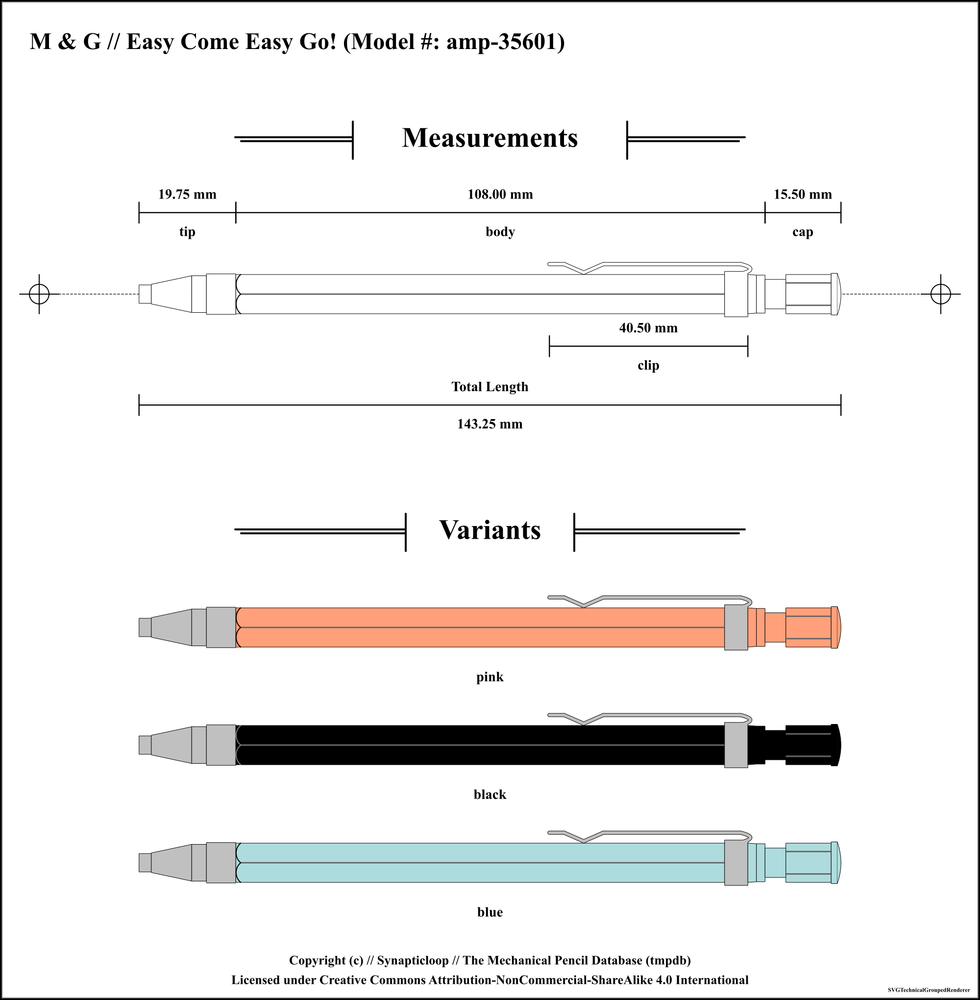

# M &amp; G

Available pencil definitions:

 - Easy Come Easy Go! amp-35601 - (2.0mm) 

## M &amp; G Easy Come Easy Go! amp-35601 - (2.0mm) 

Accuracy level for information on this pencil: `high`

### Pencil Information

| `---Item---` | `---Information---` |
| ---: | :--- |
| **Brand** | M &amp; G |
| **Model name** | Easy Come Easy Go! |
| **Model number** | amp-35601 |
| **Weight** | undefined g |
| **Mechanism** | click |
| **Lead size** | 2.0 mm |
| **Lead shape** | cylindrical |
| **Maximum lead length** | undefined |
| **Manufactured in** | unknown |
### Pencil Measurements

| `---Item---` | `---Information---` | `---Offset---` |
| ---: | :--- | :--- |

### Colours

| Colour | SKU | Manufacture dates |
| ---: | :--- | :--- |
| **pink** | unrecorded | From: undefined to undefined |
| **black** | unrecorded | From: undefined to undefined |
| **blue** | unrecorded | From: undefined to undefined |

---

### Accuracy Designations

#### low

 - Physical pencil not present
 - Measurements of the pencil were not taken with a precision tool, and may have been estimated from supplied images.
 - The overall look of the pencil and the relative dimensions should be within reasonable and relative bounds.
 - The pencil may be based on a third party branded model that is identical to the original.
 - It is unlikely that internal measurements have any level of relative accuracy, and, where supplied have been estimated.
 - There may be a low level of accuracy of the colours of the pencil's parts.

#### medium

 - Physical pencil present, however no precision measurement tool was used, or physical pencil not present and image used.  Where an image is used for measurements, an accurate measuring scale is included with the image.
 - Not all pencil measurements were taken with a precision tool, (especially where there are internal components which access could not be gained).
 - External measurements may have been accurately measured, however internal components may not have been measured.
 - The pencil may be based on a first/third party branded model that is identical to the original.
 - The accuracy of the colours of the pencil's parts may not be reflected by the rendered images.

#### high

 - Physical pencil used for measurements.
 - Physical pencil not present, but source technical documents used for measurements.
 - Pencil measurements taken with a high precision tool.
 - Internal measurements may not be available due to disassembly challenges.
 - The accuracy of the colours of the pencil's parts may not be reflected by the rendered images.

#### unknown

 - The accuracy level for this mechanical pencil could not be determined.
 - The accuracy of the colours of the pencil's parts may not be reflected by the rendered images.

