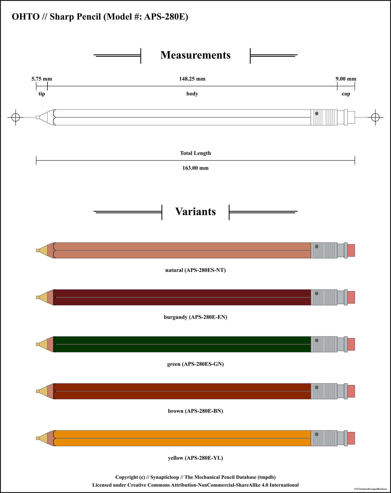
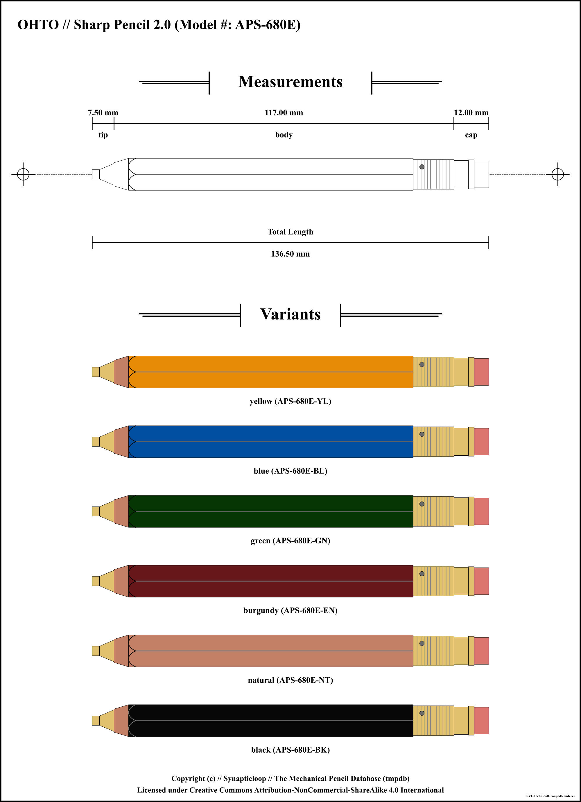
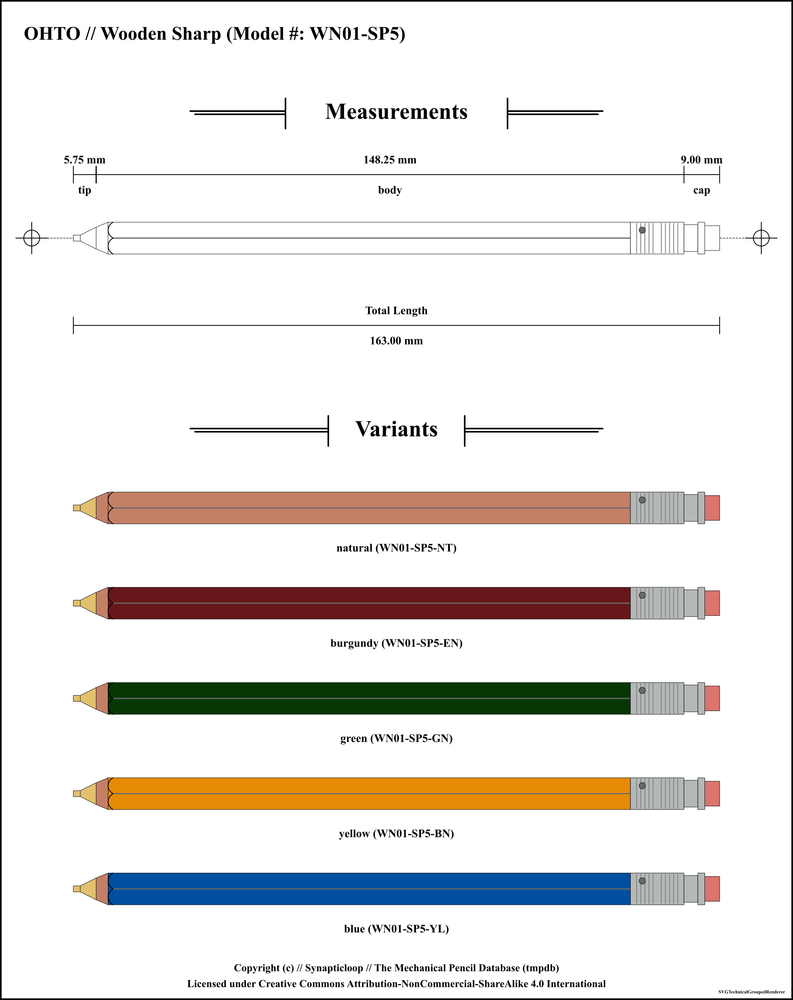
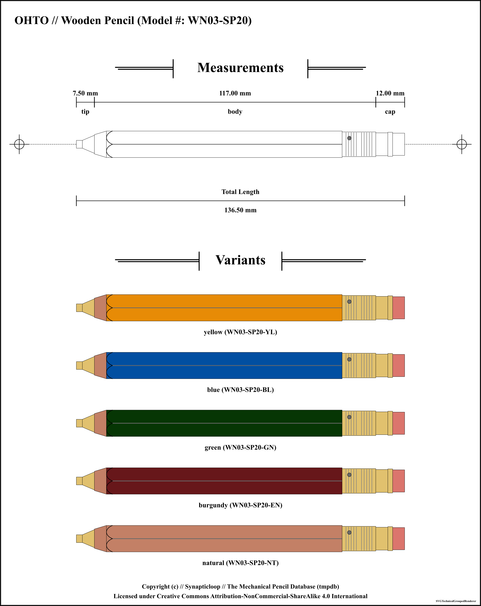

# OHTO

Available pencil definitions:

 - Sharp Pencil // Model #: APS-280E - (0.5mm) 

 - Sharp Pencil 2.0 // Model #: APS-680E - (2.0mm) 

 - Wooden Sharp // Model #: WN01-SP5 - (0.5mm) 

 - Wooden Pencil // Model #: WN03-SP20 - (2.0mm) 

## OHTO Sharp Pencil // Model #: APS-280E - (0.5mm) 

Accuracy level for information on this pencil: `medium`

### Pencil Information

| `---Item---` | `---Information---` |
| ---: | :--- |
| **Brand** | OHTO |
| **Model name** | Sharp Pencil |
| **Model number** | APS-280E |
| **Weight** | 4.8 g |
| **Mechanism** | click |
| **Lead size** | 0.5 mm |
| **Lead shape** | cylindrical |
| **Maximum lead length** | undefined |
| **Manufactured in** | Japan |
| **`---Feature---`** | **`---Location---`** |
| **eraser** | End of pencil, attached to cap |
### Pencil Measurements

_(Note: all offsets are from the start of the pencil)_

| `---Item---` | `---Offset---` | `---Length---` |
| ---: | ---: | ---: |
| **tip** | 0 mm | 5.75 mm |
| **body** | 5.75 mm | 148.25 mm |
| **cap** | 154 mm | 9 mm |
| | **Pencil length** | 163 mm |

### Colours

| Colour | SKU | Manufacture dates |
| ---: | :--- | :--- |
| **natural** | APS-280ES-NT | From: undefined to undefined |
| **burgundy** | APS-280E-EN | From: undefined to undefined |
| **green** | APS-280ES-GN | From: undefined to undefined |
| **brown** | APS-280E-BN | From: undefined to undefined |
| **yellow** | APS-280E-YL | From: undefined to undefined |

---

## OHTO Sharp Pencil 2.0 // Model #: APS-680E - (2.0mm) 

Accuracy level for information on this pencil: `high`

### Pencil Information

| `---Item---` | `---Information---` |
| ---: | :--- |
| **Brand** | OHTO |
| **Model name** | Sharp Pencil 2.0 |
| **Model number** | APS-680E |
| **Weight** | 11 g |
| **Mechanism** | click |
| **Lead size** | 2.0 mm |
| **Lead shape** | cylindrical |
| **Maximum lead length** | undefined |
| **Manufactured in** | Japan |
| **`---Feature---`** | **`---Location---`** |
| **eraser** | End of pencil, attached to cap |
### Pencil Measurements

_(Note: all offsets are from the start of the pencil)_

| `---Item---` | `---Offset---` | `---Length---` |
| ---: | ---: | ---: |
| **tip** | 0 mm | 7.5 mm |
| **body** | 7.5 mm | 117 mm |
| **cap** | 124.5 mm | 12 mm |
| | **Pencil length** | 136.5 mm |

### Colours

| Colour | SKU | Manufacture dates |
| ---: | :--- | :--- |
| **yellow** | APS-680E-YL | From: undefined to undefined |
| **blue** | APS-680E-BL | From: undefined to undefined |
| **green** | APS-680E-GN | From: undefined to undefined |
| **burgundy** | APS-680E-EN | From: undefined to undefined |
| **natural** | APS-680E-NT | From: undefined to undefined |
| **black** | APS-680E-BK | From: undefined to undefined |

---

## OHTO Wooden Sharp // Model #: WN01-SP5 - (0.5mm) 

Accuracy level for information on this pencil: `medium`

### Pencil Information

| `---Item---` | `---Information---` |
| ---: | :--- |
| **Brand** | OHTO |
| **Model name** | Wooden Sharp |
| **Model number** | WN01-SP5 |
| **Weight** | 4.8 g |
| **Mechanism** | click |
| **Lead size** | 0.5 mm |
| **Lead shape** | cylindrical |
| **Maximum lead length** | undefined |
| **Manufactured in** | unknown |
| **`---Feature---`** | **`---Location---`** |
| **eraser** | End of pencil, attached to cap |
### Pencil Measurements

_(Note: all offsets are from the start of the pencil)_

| `---Item---` | `---Offset---` | `---Length---` |
| ---: | ---: | ---: |
| **tip** | 0 mm | 5.75 mm |
| **body** | 5.75 mm | 148.25 mm |
| **cap** | 154 mm | 9 mm |
| | **Pencil length** | 163 mm |

### Colours

| Colour | SKU | Manufacture dates |
| ---: | :--- | :--- |
| **natural** | WN01-SP5-NT | From: undefined to undefined |
| **burgundy** | WN01-SP5-EN | From: undefined to undefined |
| **green** | WN01-SP5-GN | From: undefined to undefined |
| **yellow** | WN01-SP5-BN | From: undefined to undefined |
| **blue** | WN01-SP5-YL | From: undefined to undefined |

---

## OHTO Wooden Pencil // Model #: WN03-SP20 - (2.0mm) 

Accuracy level for information on this pencil: `high`

### Pencil Information

| `---Item---` | `---Information---` |
| ---: | :--- |
| **Brand** | OHTO |
| **Model name** | Wooden Pencil |
| **Model number** | WN03-SP20 |
| **Weight** | 11 g |
| **Mechanism** | click |
| **Lead size** | 2.0 mm |
| **Lead shape** | cylindrical |
| **Maximum lead length** | undefined |
| **Manufactured in** | Japan |
| **`---Feature---`** | **`---Location---`** |
| **eraser** | End of pencil, attached to cap |
### Pencil Measurements

_(Note: all offsets are from the start of the pencil)_

| `---Item---` | `---Offset---` | `---Length---` |
| ---: | ---: | ---: |
| **tip** | 0 mm | 7.5 mm |
| **body** | 7.5 mm | 117 mm |
| **cap** | 124.5 mm | 12 mm |
| | **Pencil length** | 136.5 mm |

### Colours

| Colour | SKU | Manufacture dates |
| ---: | :--- | :--- |
| **yellow** | WN03-SP20-YL | From: undefined to undefined |
| **blue** | WN03-SP20-BL | From: undefined to undefined |
| **green** | WN03-SP20-GN | From: undefined to undefined |
| **burgundy** | WN03-SP20-EN | From: undefined to undefined |
| **natural** | WN03-SP20-NT | From: undefined to undefined |

---

### Accuracy Designations

#### low

 - Where any one of these things are true.
 - Physical pencil not present for measurement
 - Measurements of the pencil were not taken with a precision tool, and may have been estimated from supplied images.
 - The overall look of the pencil and the relative dimensions should be within reasonable and relative bounds.
 - The pencil may be based on a third party branded model that is identical to the original.
 - It is unlikely that internal measurements have any level of relative accuracy, and, where supplied have been estimated.
 - There may be a low level of accuracy of the colours of the pencil's parts.

#### medium

 - Where any one of these things are true.
 - Physical pencil present, however no precision measurement tool was used.
 - Physical pencil not present and image used for measurements, an accurate measuring scale is included with the image.
 - Not all pencil measurements were taken with a precision tool, (especially where there are internal components which access could not be gained).
 - External measurements may have been accurately measured, however internal components may not have been measured.
 - The pencil may be based on a first/third party branded model that is identical to the original.
 - The accuracy of the colours of the pencil's parts may not be reflected by the rendered images.

#### high

 - Where all of these things are true (with caveats).
 - Physical pencil used for measurements, or physical pencil not present, but source technical documents used for measurements.
 - Pencil measurements taken with a high precision tool.
 - Internal measurements may not be available due to disassembly challenges.
 - The accuracy of the colours of the pencil's parts may not be reflected by the rendered images.

#### unknown

 - The accuracy level for this mechanical pencil could not be determined.
 - The accuracy of the colours of the pencil's parts may not be reflected by the rendered images.

