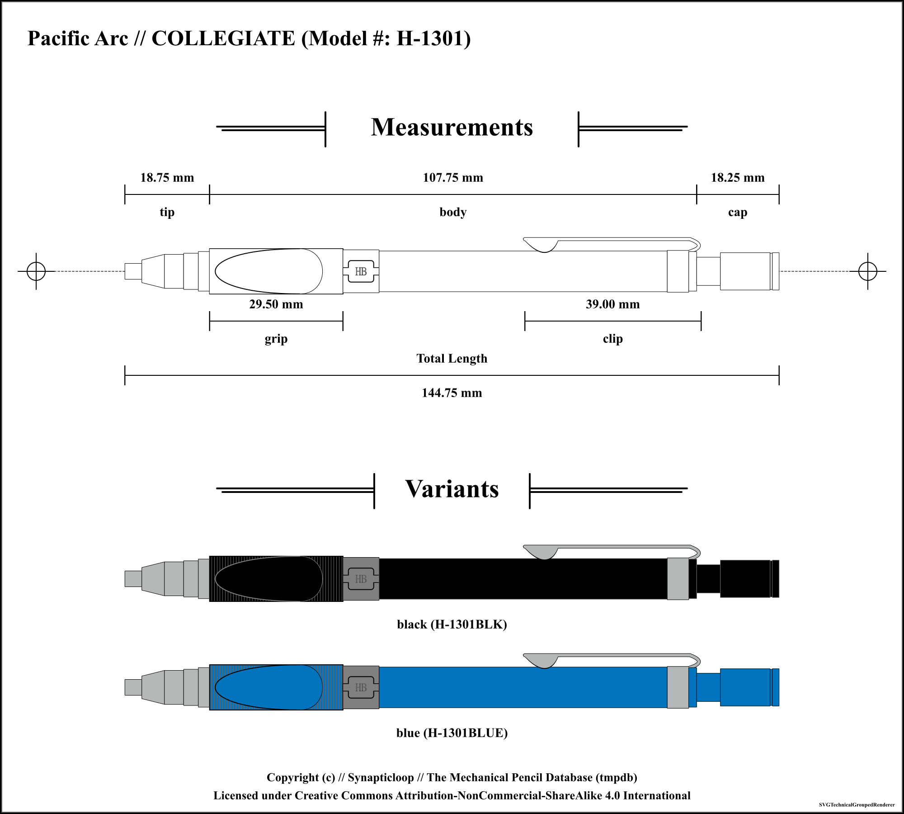
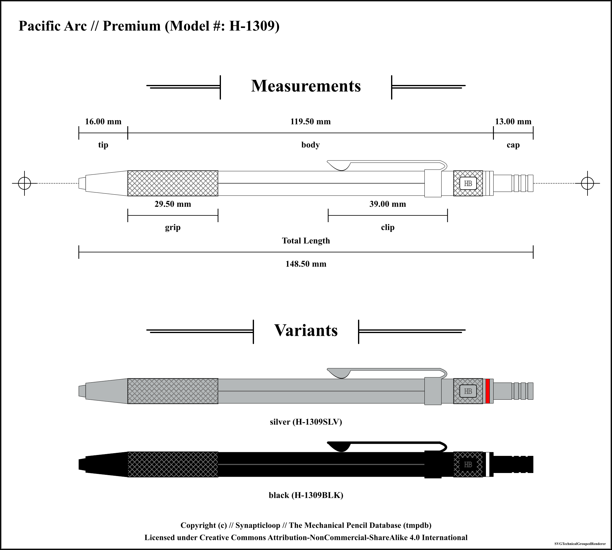
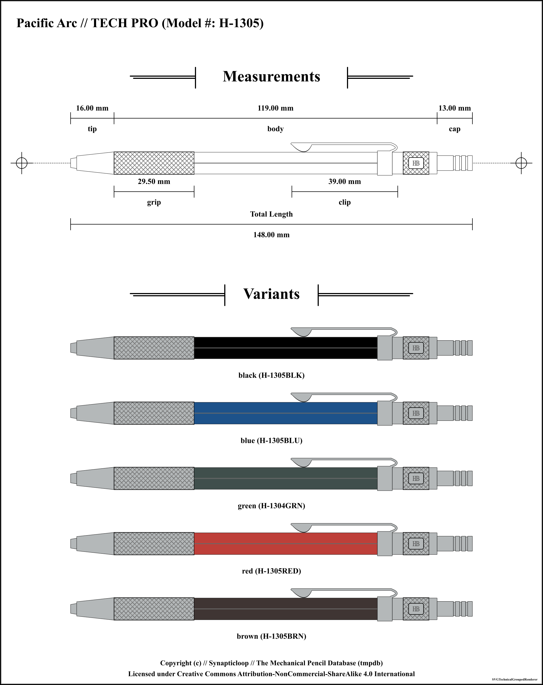

# Pacific Arc

Available pencil definitions:

 - COLLEGIATE H-1301 - (2.0mm) 

 - Premium H-1309 - (2.0mm) 

 - TECH PRO H-1305 - (2.0mm) 

## Pacific Arc COLLEGIATE H-1301 - (2.0mm) 

Accuracy level for information on this pencil: `high`

### Pencil Information

| `---Item---` | `---Information---` |
| ---: | :--- |
| **Brand** | Pacific Arc |
| **Model name** | COLLEGIATE |
| **Model number** | H-1301 |
| **Weight** | undefined g |
| **Mechanism** | click |
| **Lead size** | 2.0 mm |
| **Lead shape** | cylindrical |
| **Maximum lead length** | undefined |
| **Manufactured in** | unknown |
| **`---Feature---`** | **`---Location---`** |
| **sharpener** | Inside cap |
### Pencil Measurements

_(Note: all offsets are from the start of the pensil)_

| `---Item---` | `---Offset---` | `---Length---` |
| ---: | ---: | ---: |
| **tip** | 0 mm | 18.75 mm |
| **body** | 18.75 mm | 107.75 mm |
| **cap** | 126.5 mm | 18.25 mm |
| **grip** | 18.75 mm | 29.5 mm |
| **clip** | 120 mm | 39 mm |
| | Pencil length | 144.75 mm |

### Colours

| Colour | SKU | Manufacture dates |
| ---: | :--- | :--- |
| **black** | H-1301BLK | From: undefined to undefined |
| **blue** | H-1301BLUE | From: undefined to undefined |

---

## Pacific Arc Premium H-1309 - (2.0mm) 

Accuracy level for information on this pencil: `high`

### Pencil Information

| `---Item---` | `---Information---` |
| ---: | :--- |
| **Brand** | Pacific Arc |
| **Model name** | Premium |
| **Model number** | H-1309 |
| **Weight** | undefined g |
| **Mechanism** |  |
| **Lead size** | 2.0 mm |
| **Lead shape** | cylindrical |
| **Maximum lead length** | undefined |
| **Manufactured in** | unknown |
| **`---Feature---`** | **`---Location---`** |
| **sharpener** | inside cap |
### Pencil Measurements

_(Note: all offsets are from the start of the pensil)_

| `---Item---` | `---Offset---` | `---Length---` |
| ---: | ---: | ---: |
| **tip** | 0 mm | 16 mm |
| **body** | 16 mm | 119.5 mm |
| **cap** | 135.5 mm | 13 mm |
| **grip** | 16 mm | 29.5 mm |
| **clip** | 113 mm | 39 mm |
| | Pencil length | 148.5 mm |

### Colours

| Colour | SKU | Manufacture dates |
| ---: | :--- | :--- |
| **silver** | H-1309SLV | From: undefined to undefined |
| **black** | H-1309BLK | From: undefined to undefined |

---

## Pacific Arc TECH PRO H-1305 - (2.0mm) 

Accuracy level for information on this pencil: `high`

### Pencil Information

| `---Item---` | `---Information---` |
| ---: | :--- |
| **Brand** | Pacific Arc |
| **Model name** | TECH PRO |
| **Model number** | H-1305 |
| **Weight** | undefined g |
| **Mechanism** | clutch |
| **Lead size** | 2.0 mm |
| **Lead shape** | cylindrical |
| **Maximum lead length** | undefined |
| **Manufactured in** | unknown |
| **`---Feature---`** | **`---Location---`** |
| **sharpener** | Inside cap |
### Pencil Measurements

_(Note: all offsets are from the start of the pensil)_

| `---Item---` | `---Offset---` | `---Length---` |
| ---: | ---: | ---: |
| **tip** | 0 mm | 16 mm |
| **body** | 16 mm | 119 mm |
| **cap** | 135 mm | 13 mm |
| **grip** | 16 mm | 29.5 mm |
| **clip** | 113 mm | 39 mm |
| | Pencil length | 148 mm |

### Colours

| Colour | SKU | Manufacture dates |
| ---: | :--- | :--- |
| **black** | H-1305BLK | From: undefined to undefined |
| **blue** | H-1305BLU | From: undefined to undefined |
| **green** | H-1304GRN | From: undefined to undefined |
| **red** | H-1305RED | From: undefined to undefined |
| **brown** | H-1305BRN | From: undefined to undefined |

---

### Accuracy Designations

#### low

 - Where any one of these things are true.
 - Physical pencil not present for measurement
 - Measurements of the pencil were not taken with a precision tool, and may have been estimated from supplied images.
 - The overall look of the pencil and the relative dimensions should be within reasonable and relative bounds.
 - The pencil may be based on a third party branded model that is identical to the original.
 - It is unlikely that internal measurements have any level of relative accuracy, and, where supplied have been estimated.
 - There may be a low level of accuracy of the colours of the pencil's parts.

#### medium

 - Where any one of these things are true.
 - Physical pencil present, however no precision measurement tool was used.
 - Physical pencil not present and image used for measurements, an accurate measuring scale is included with the image.
 - Not all pencil measurements were taken with a precision tool, (especially where there are internal components which access could not be gained).
 - External measurements may have been accurately measured, however internal components may not have been measured.
 - The pencil may be based on a first/third party branded model that is identical to the original.
 - The accuracy of the colours of the pencil's parts may not be reflected by the rendered images.

#### high

 - Where all of these things are true (with caveats).
 - Physical pencil used for measurements, or physical pencil not present, but source technical documents used for measurements.
 - Pencil measurements taken with a high precision tool.
 - Internal measurements may not be available due to disassembly challenges.
 - The accuracy of the colours of the pencil's parts may not be reflected by the rendered images.

#### unknown

 - The accuracy level for this mechanical pencil could not be determined.
 - The accuracy of the colours of the pencil's parts may not be reflected by the rendered images.

