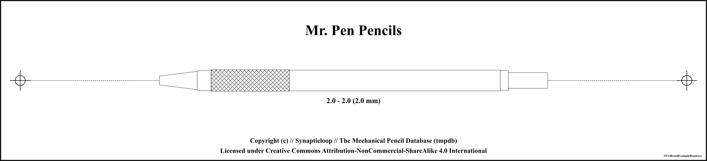
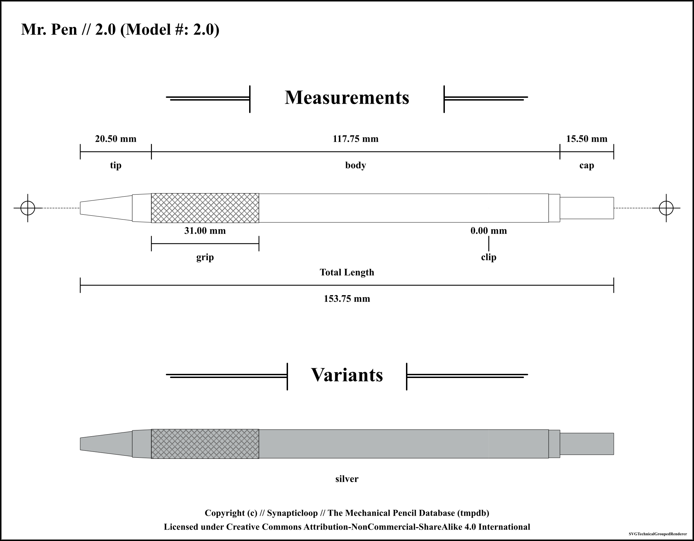

# Mr. Pen

Available pencil definitions:

 - 2.0 // Model #: 2.0 - (2.0 mm) 

## Mr. Pen 2.0 // Model #: 2.0 - (2.0mm) 

Accuracy level for information on this pencil: `high`

### Pencil Information

| `---Item---` | `---Information---` |
| ---: | :--- |
| **Brand** | Mr. Pen |
| **Model name** | 2.0 |
| **Model number** | 2.0 |
| **Weight** | undefined g |
| **Mechanism** | click |
| **Lead size** | 2.0 mm |
| **Lead shape** | cylindrical |
| **Maximum lead length** | undefined |
| **Manufactured in** | unknown |
| **`---Feature---`** | **`---Location---`** |
| **sharpener** | inside cap |
| **eraser** | inside shaft |
### Pencil Measurements

_(Note: all offsets are from the start of the pencil)_

| `---Item---` | `---Offset---` | `---Length---` |
| ---: | ---: | ---: |
| **tip** | 0 mm | 20.5 mm |
| **body** | 20.5 mm | 117.75 mm |
| **cap** | 138.25 mm | 15.5 mm |
| **grip** | 20.5 mm | 31 mm |
| **clip** | 117.75 mm | 0 mm |
| | **Pencil length** | 153.75 mm |

### Colours

| Colour | SKU | Manufacture dates |
| ---: | :--- | :--- |
| **silver** | unrecorded | From: undefined to undefined |

---

### Accuracy Designations

#### low

 - Where any one of these things are true.
 - Physical pencil not present for measurement
 - Measurements of the pencil were not taken with a precision tool, and may have been estimated from supplied images.
 - The overall look of the pencil and the relative dimensions should be within reasonable and relative bounds.
 - The pencil may be based on a third party branded model that is identical to the original.
 - It is unlikely that internal measurements have any level of relative accuracy, and, where supplied have been estimated.
 - There may be a low level of accuracy of the colours of the pencil's parts.

#### medium

 - Where any one of these things are true.
 - Physical pencil present, however no precision measurement tool was used.
 - Physical pencil not present and image used for measurements, an accurate measuring scale is included with the image.
 - Not all pencil measurements were taken with a precision tool, (especially where there are internal components which access could not be gained).
 - External measurements may have been accurately measured, however internal components may not have been measured.
 - The pencil may be based on a first/third party branded model that is identical to the original.
 - The accuracy of the colours of the pencil's parts may not be reflected by the rendered images.

#### high

 - Where all of these things are true (with caveats).
 - Physical pencil used for measurements, or physical pencil not present, but source technical documents used for measurements.
 - Pencil measurements taken with a high precision tool.
 - Internal measurements may not be available due to disassembly challenges.
 - The accuracy of the colours of the pencil's parts may not be reflected by the rendered images.

#### unknown

 - The accuracy level for this mechanical pencil could not be determined.
 - The accuracy of the colours of the pencil's parts may not be reflected by the rendered images.

---

_`[Rendered with MDBrandGroupRenderer]`_

---

