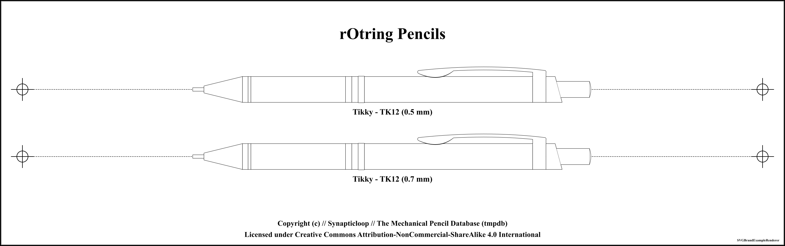
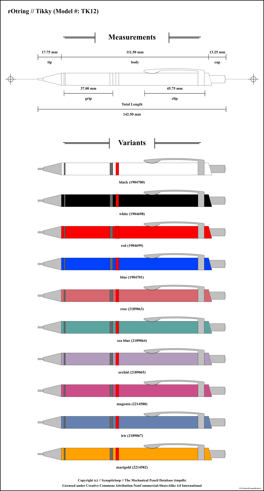
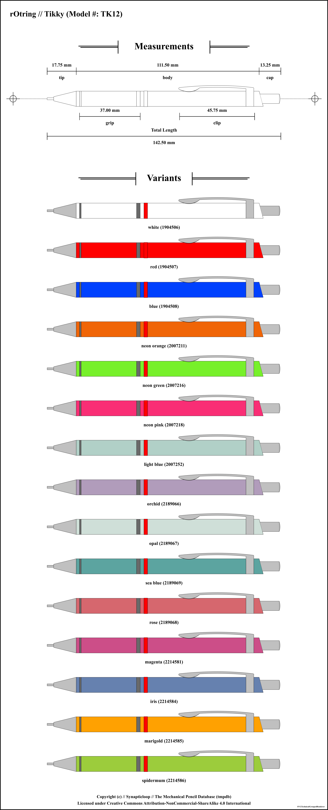

# rOtring

Available pencil definitions:

 - Tikky // Model #: TK12 - (0.5 mm) 

 - Tikky // Model #: TK12 - (0.7 mm) 

## rOtring Tikky // Model #: TK12 - (0.5mm) 

Accuracy level for information on this pencil: `high`

### Pencil Information

| `---Item---` | `---Information---` |
| ---: | :--- |
| **Brand** | rOtring |
| **Model name** | Tikky |
| **Model number** | TK12 |
| **Weight** | 0 g |
| **Mechanism** | click |
| **Lead size** | 0.5 mm |
| **Lead shape** | cylindrical |
| **Maximum lead length** | undefined |
| **Manufactured in** |  |
| **`---Feature---`** | **`---Location---`** |
| **eraser** | inside shaft |
### Pencil Measurements

_(Note: all offsets are from the start of the pencil)_

| `---Item---` | `---Offset---` | `---Length---` |
| ---: | ---: | ---: |
| **tip** | 0 mm | 16.5 mm |
| **body** | 16.5 mm | 110.7 mm |
| **cap** | 127.19999999999999 mm | 12 mm |
| **grip** | 18.5 mm | 36.75 mm |
| **clip** | 118.7 mm | 5.25 mm |
| | **Pencil length** | 139.2 mm |

### Colours

| Colour | SKU | Manufacture dates |
| ---: | :--- | :--- |
| **black** | 1904700 | From:  to undefined |
| **white** | 1904698 | From:  to undefined |
| **red** | 1904699 | From:  to undefined |
| **blue** | 1904701 | From:  to undefined |
| **rose** | 2189063 | From:  to undefined |
| **sea blue** | 2189064 | From:  to undefined |
| **orchid** | 2189065 | From:  to undefined |
| **magenta** | 2214580 | From: 2025 to undefined |
| **iris** | 2189067 | From: 2025 to undefined |
| **marigold** | 2214582 | From: 2025 to undefined |

---

## rOtring Tikky // Model #: TK12 - (0.7mm) 

Accuracy level for information on this pencil: `high`

### Pencil Information

| `---Item---` | `---Information---` |
| ---: | :--- |
| **Brand** | rOtring |
| **Model name** | Tikky |
| **Model number** | TK12 |
| **Weight** | 0 g |
| **Mechanism** | click |
| **Lead size** | 0.7 mm |
| **Lead shape** | cylindrical |
| **Maximum lead length** | undefined |
| **Manufactured in** |  |
| **`---Feature---`** | **`---Location---`** |
| **eraser** | inside shaft |
### Pencil Measurements

_(Note: all offsets are from the start of the pencil)_

| `---Item---` | `---Offset---` | `---Length---` |
| ---: | ---: | ---: |
| **tip** | 0 mm | 16.5 mm |
| **body** | 16.5 mm | 110.7 mm |
| **cap** | 127.19999999999999 mm | 12 mm |
| **grip** | 18.5 mm | 36.75 mm |
| **clip** | 118.7 mm | 5.25 mm |
| | **Pencil length** | 139.2 mm |

### Colours

| Colour | SKU | Manufacture dates |
| ---: | :--- | :--- |
| **white** | 1904506 | From: undefined to undefined |
| **red** | 1904507 | From: undefined to undefined |
| **blue** | 1904508 | From: undefined to undefined |
| **neon orange** | 2007211 | From: undefined to undefined |
| **neon green** | 2007216 | From: undefined to undefined |
| **neon pink** | 2007218 | From: undefined to undefined |
| **light blue** | 2007252 | From: undefined to undefined |
| **orchid** | 2189066 | From: undefined to undefined |
| **opal** | 2189067 | From: undefined to undefined |
| **sea blue** | 2189069 | From: undefined to undefined |
| **rose** | 2189068 | From: undefined to undefined |
| **magenta** | 2214581 | From: undefined to undefined |
| **iris** | 2214584 | From: undefined to undefined |
| **marigold** | 2214585 | From: undefined to undefined |
| **spidermum** | 2214586 | From: undefined to undefined |

---

### Accuracy Designations

#### low

 - Where any one of these things are true.
 - Physical pencil not present for measurement
 - Measurements of the pencil were not taken with a precision tool, and may have been estimated from supplied images.
 - The overall look of the pencil and the relative dimensions should be within reasonable and relative bounds.
 - The pencil may be based on a third party branded model that is identical to the original.
 - It is unlikely that internal measurements have any level of relative accuracy, and, where supplied have been estimated.
 - There may be a low level of accuracy of the colours of the pencil's parts.

#### medium

 - Where any one of these things are true.
 - Physical pencil present, however no precision measurement tool was used.
 - Physical pencil not present and image used for measurements, an accurate measuring scale is included with the image.
 - Not all pencil measurements were taken with a precision tool, (especially where there are internal components which access could not be gained).
 - External measurements may have been accurately measured, however internal components may not have been measured.
 - The pencil may be based on a first/third party branded model that is identical to the original.
 - The accuracy of the colours of the pencil's parts may not be reflected by the rendered images.

#### high

 - Where all of these things are true (with caveats).
 - Physical pencil used for measurements, or physical pencil not present, but source technical documents used for measurements.
 - Pencil measurements taken with a high precision tool.
 - Internal measurements may not be available due to disassembly challenges.
 - The accuracy of the colours of the pencil's parts may not be reflected by the rendered images.

#### unknown

 - The accuracy level for this mechanical pencil could not be determined.
 - The accuracy of the colours of the pencil's parts may not be reflected by the rendered images.

---

_`[Rendered with MDBrandGroupRenderer]`_

---

